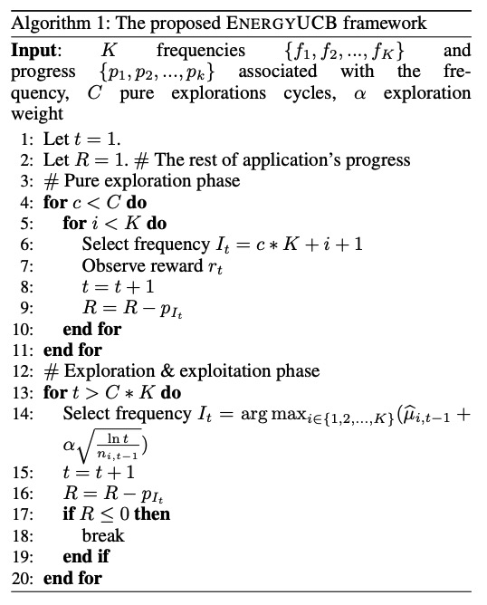
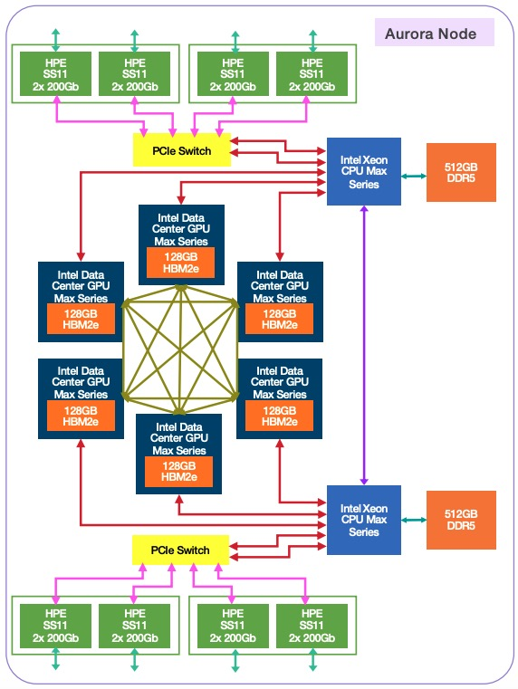
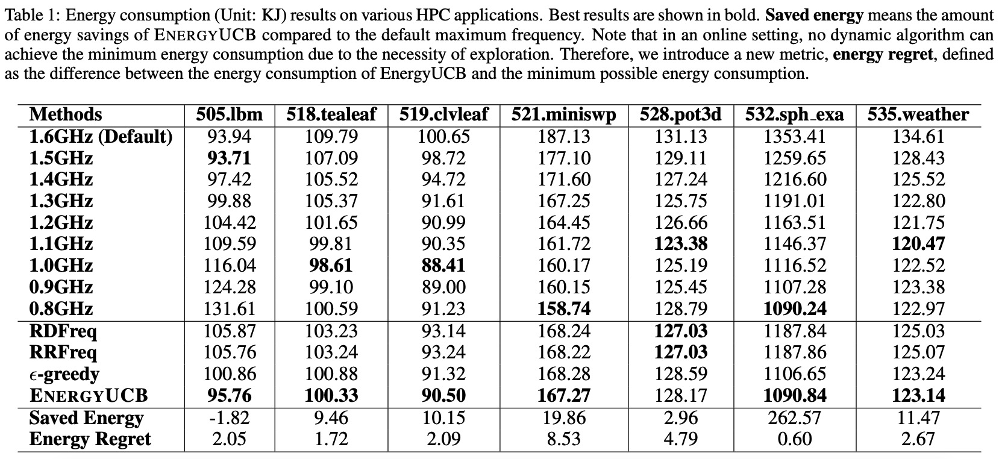

# EnergyUCB-Bandit
The official EnergyUCB implementation for the paper "[Online Energy Optimization in GPUs: A Multi-Armed Bandit Approach](https://arxiv.org/abs/2410.11855)".

## 🏆 Contributions
• Problem Formulation: We formally define the **new problem of online GPU energy optimization** and formulate it as a **multi-armed bandit framework**, which inherently addresses the exploration \& exploitation dilemma across frequencies in the online setting. <br/>
• Algorithm: We develop a principled **multi-armed bandit framework EnergyUCB** that evaluates GPU performance in real-time using the ratio of GPU core utilization to uncore utilization. The reward formulation is designed to **balance the performance-energy trade-off** by considering both energy consumption and performance. <br/>
• Evaluation: We **collect a dataset from PVC GPUs installed in the Aurora supercomputer, the second-fastest supercomputer in the world**. Using this dataset, we evaluate our proposed EnergyUCB framework on various real-world HPC applications. **The experimental results demonstrate that EnergyUCB can achieve energy savings for Aurora compared to its default settings**. <br/>

## 🔎 EnergyUCB Algorithm
<div align="left">

</div>

## 🤖 Architcture of an Aurora Node
<div align="left">

</div>

## ⚙️ Getting Started
### Environment
* python             3.10.14
* numpy              1.26.4
* pandas             2.2.2

### Run
Run the EnergyUCB.py with the following command in a terminal:

`python EnergyUCB.py --app app`

Replace app with the name of HPC application.

For exmaple, if we want to optimize emnergy in GPUs for the HPC application 532.sph_exa_t, the command should be as follows:

`python EnergyUCB.py --app 532.sph_exa_t`

## 📈 Experimental Results
### Energy Consumption
<div align="center">

</div>
The experimentral results demonstrate the effectivenss of EnergyUCB to online minimize energy consumption.

## 📝 Citation
If you find this repository useful for your work, please consider citing the paper as follows:

```bibtex
@article{xu2024online,
  title={Online Energy Optimization in GPUs: A Multi-Armed Bandit Approach},
  author={Xu, Xiongxiao and Bekele, Solomon Abera and Videau, Brice and Shu, Kai},
  journal={arXiv preprint arXiv:2410.11855},
  year={2024}
}
```
